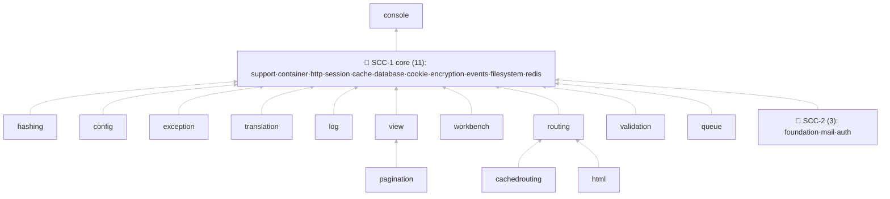

# L42x → Laravel 13 — Dependency Graph

Digenerate dari `.migration-verified-records.json` (edge = `use`-statement realDeps).
Warna node = `migrationClass`. Panah **X → Y** = "X butuh Y lebih dulu".

**Legenda warna:** 🟩 done · 🟦 shim (standalone/symfony) · 🟨 reshape-callsites · 🟥 flip-only · ⬜ evaporate · 🟪 app-space-extract

## 1. Condensed (per-layer, SCC dilipat) — untuk baca cepat

Critical path: **console → [SCC-1] → hashing/routing/… → [SCC-2]**

## 2. Full (semua 28 node, edge asli)

Dua kotak merah = cyclic cluster (SCC) yang **tak bisa diurutkan internal** — putus via `Contracts` dulu.

```mermaid
flowchart BT
  classDef done fill:#b7e1cd,stroke:#2b7a4b,color:#000;
  classDef shim fill:#a4c2f4,stroke:#1c4587,color:#000;
  classDef reshape fill:#ffe599,stroke:#bf9000,color:#000;
  classDef flip fill:#ea9999,stroke:#990000,color:#000;
  classDef evap fill:#d9d9d9,stroke:#666,color:#000;
  classDef appx fill:#d5a6bd,stroke:#741b47,color:#000;
  subgraph SCC1["🔴 SCC-1 · core ball of mud (11, cyclic)"]
    support
    container
    http
    session
    cache
    database
    cookie
    encryption
    events
    filesystem
    redis
  end
  subgraph SCC2["🔴 SCC-2 · bootstrap knot (3, cyclic)"]
    foundation
    mail
    auth
  end
  console
  hashing
  config
  exception
  translation
  log
  view
  workbench
  routing
  validation
  queue
  cachedrouting
  html
  pagination
  auth --> console
  auth --> cookie
  auth --> database
  auth --> events
  auth --> filesystem
  auth --> hashing
  auth --> mail
  auth --> session
  auth --> support
  cache --> console
  cache --> database
  cache --> encryption
  cache --> filesystem
  cache --> redis
  cache --> support
  cachedrouting --> container
  cachedrouting --> events
  cachedrouting --> routing
  cachedrouting --> support
  config --> filesystem
  config --> support
  container --> support
  cookie --> encryption
  cookie --> support
  database --> cache
  database --> console
  database --> container
  database --> events
  database --> filesystem
  database --> support
  encryption --> support
  events --> container
  events --> support
  exception --> support
  filesystem --> support
  foundation --> console
  foundation --> support
  foundation --> filesystem
  foundation --> http
  foundation --> config
  foundation --> routing
  foundation --> view
  foundation --> container
  foundation --> exception
  foundation --> events
  foundation --> auth
  hashing --> support
  html --> routing
  html --> session
  html --> support
  http --> session
  http --> support
  log --> events
  log --> support
  mail --> container
  mail --> events
  mail --> foundation
  mail --> log
  mail --> queue
  mail --> support
  mail --> view
  pagination --> http
  pagination --> support
  pagination --> view
  queue --> cache
  queue --> console
  queue --> container
  queue --> database
  queue --> encryption
  queue --> events
  queue --> filesystem
  queue --> http
  queue --> redis
  queue --> support
  redis --> support
  routing --> container
  routing --> http
  routing --> support
  routing --> session
  routing --> filesystem
  routing --> events
  routing --> console
  session --> cache
  session --> console
  session --> cookie
  session --> database
  session --> filesystem
  session --> support
  support --> container
  support --> http
  translation --> filesystem
  translation --> support
  validation --> container
  validation --> database
  validation --> support
  view --> container
  view --> events
  view --> filesystem
  view --> support
  workbench --> console
  workbench --> filesystem
  workbench --> support
  class auth flip;
  class cache reshape;
  class cachedrouting evap;
  class config reshape;
  class console flip;
  class container flip;
  class cookie shim;
  class database flip;
  class encryption shim;
  class events reshape;
  class exception evap;
  class filesystem flip;
  class foundation flip;
  class hashing done;
  class html appx;
  class http flip;
  class log reshape;
  class mail reshape;
  class pagination reshape;
  class queue flip;
  class redis flip;
  class routing reshape;
  class session shim;
  class support flip;
  class translation flip;
  class validation flip;
  class view flip;
  class workbench evap;
```

